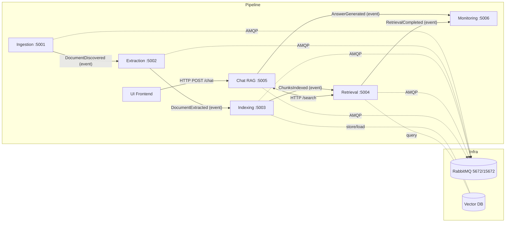

# MARP-Guide Chatbot
### Assessment 1 – Core RAG Pipeline

---

## Tier 1 Choice:
Basic Monitoring Dashboard

## Tier 2 Choice:
Hybrid Search

## 📘 Project Overview
The **MARP-Guide Chatbot** is a networked microservices system that answers questions about Lancaster University’s Manual of Academic Regulations and Procedures (MARP).
Answers are retrieved from MARP PDF documents, properly cited (title + page + link), and generated through a Retrieval-Augmented Generation (RAG) pipeline.

---

## High-Level Architecture Overview

### Microservices and Responsibilities

| Service | Port | Responsibility | Publishes | Consumes |
|:--|:--:|:--|:--|:--|
| **Ingestion** | 5001 | Discover & download MARP PDFs | `DocumentDiscovered` | – |
| **Extraction** | 5002 | Extract text from PDFs | `DocumentExtracted` | `DocumentDiscovered` |
| **Indexing** | 5003 | Chunk text & create embeddings | `ChunksIndexed` | `DocumentExtracted` |
| **Retrieval** | 5004 | Semantic search over vectors | `RetrievalCompleted` | `ChunksIndexed` |
| **Chat (RAG)** | 5005 | Generate answers with citations | `AnswerGenerated` | – |
| **Monitoring** | 5006 | Aggregate metrics & health | – | `RetrievalCompleted`, `AnswerGenerated` |

---

### Mermaid Diagram

---

## Setup and Run Instructions

Follow these steps to build and run the MARP-Guide Chatbot locally using Docker Compose.  

---

### Prerequisites
Docker Desktop (or Docker Engine + Compose) installed  
Internet access for MARP PDFs and OpenRouter API  

---

### Clone Repository
"git clone https://github.com/Rickycg21/MARP.Guide.Y3.gitmarp-guide.git"  
"cd Rickycg21/MARP.Guide.Y3.gitmarp-guide"  

---

### Build & Run
"docker compose build" to build all service images  
"docker compose up" to start the entire system  
"docker compose up -d" to run in detached mode  

---

### Verify health
"curl http://localhost:5001/health"  # Ingestion  
"curl http://localhost:5002/health"  # Extraction  
"curl http://localhost:5003/health"  # Indexing  
"curl http://localhost:5004/health"  # Retrieval  
"curl http://localhost:5005/health"  # Chat  
"curl http://localhost:5006/health"  # Monitoring

---

### Trigger End-to-End Pipeline
"curl -X POST http://localhost:5001/discover" to discover MARP PDFs & publish DocumentDiscovered event to Extraction.  
Extraction and Indexing process run asynchronously via RabbitMQ events.  

! - In case of running the program for a consecutive time run:
"docker compose up -d chat --force-recreate"

"$body = @{ question = "(place your question between the quotation marks)"; top_k = 3 } | ConvertTo-Json
  Invoke-RestMethod -Method Post -Uri "http://localhost:5005/chat" `
    -ContentType "application/json" -Body $body" to ask a question.  
Chat calls Retrieval & returns an answer with ≥ 1 citation.  

"docker compose logs -f ingestion extraction indexing retrieval chat" to view service logs.  

All data is stored under /data/ (volume mounted by Docker).  

Open RabbitMQ’s web UI at "http://localhost:15672" to view live event publication.  

### Stop
"docker compose down" to stop all running containers.  

### Tests for Ingestion service
"docker compose up --build rabbitmq ingestion" to build & start Ingestion.

"docker compose logs -f ingestion" to view Ingestion logs

"curl http://localhost:5001/health" to check health.  

"curl -X POST http://localhost:5001/discover" to trigger PDF discovery. 

"curl http://localhost:5001/documents" to return the catalog of diecovered PDFs.  

"docker compose down" to stop running containers.  

---

### Tests for Extraction service
"docker compose up --build rabbitmq extraction" to build & start Extraction.  

"docker compose logs -f extraction" to view Extraction logs.  

"curl http://localhost:5001/health" to check health.  

"curl -X POST http://localhost:5002/extract/<document_id>" to trigger text extraction from a specific document.  

"curl http://localhost:5002/status/<document_id>" to view current status of a specific document.  

"curl http://localhost:5002/status" to view the full status timeline.  

"docker compose down" to stop running containers.   

---

## 🧠 Technology Stack Overview

Our MARP-Guide RAG Chatbot is a **Python-based microservices system**.

| **Layer** | **Technology** | **Purpose** |
|------------|----------------|--------------|
| **Language & Framework** | Python 3.11 + FastAPI | Lightweight async backend framework for all microservices. |
| **Web Server** | Uvicorn | Runs FastAPI apps with high-performance async I/O. |
| **Messaging** | RabbitMQ (AMQP) | Enables event-driven communication between services. |
| **Vector DB** | ChromaDB | Stores embeddings for semantic search and retrieval. |
| **Embeddings** | Sentence-Transformers (`all-MiniLM-L6-v2`) | Creates vector representations of document chunks. |
| **LLM Access** | OpenRouter API | Provides GPT-based completions for answer generation. |
| **PDF & Web Tools** | pdfplumber, BeautifulSoup4, httpx | Used for PDF extraction and MARP link discovery. |
| **Containerisation** | Docker + Docker Compose | Each service runs in its own container; `docker compose up` runs the full system. |
| **CI/CD** | GitHub Actions | Automated builds and tests on pull requests. |
| **Monitoring** | Custom Monitoring Service | Tracks health checks and event metrics across the system. |
