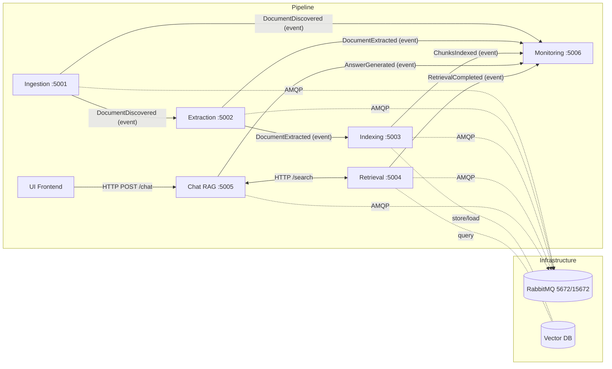

# MARP-Guide Chatbot — System Architecture

This document describes our microservices, how they communicate (HTTP + events), the ports they use, and the end-to-end data flow from PDF discovery to cited answers.

---

## Services & Responsibilities

| Service | Port | Responsibility | Key Endpoints / Queues |
|---|---:|---|---|
| **Ingestion** | **5001** | Discover & download MARP PDFs; publish new docs | `GET /health`, `POST /discover` -> publishes **DocumentDiscovered** |
| **Extraction** | **5002** | Convert PDFs to clean text per page; persist JSON | `GET /health`, (worker consumes **DocumentDiscovered**) -> publishes **DocumentExtracted** |
| **Indexing** | **5003** | Chunk text; create embeddings; store vectors | `GET /health`, (worker consumes **DocumentExtracted**) -> publishes **ChunksIndexed** |
| **Retrieval** | **5004** | Semantic search over vectors (and BM25 later) | `GET /health`, `GET /search?q=...&top_k=...` -> publishes **RetrievalCompleted** |
| **Chat (RAG)** | **5005** | Build prompt, call LLM, add citations | `GET /health`, `POST /chat` → publishes **AnswerGenerated** |
| **Monitoring** (Tier-1) | **5006** | Show health & event counters | `GET /health`, `GET /metrics`, `/monitor` (UI) |
| **RabbitMQ** | **5672 / 15672** | Event broker (AMQP); admin UI on 15672 | Queues: `DocumentDiscovered`, `DocumentExtracted`, `ChunksIndexed`, `RetrievalCompleted`, `AnswerGenerated` |
| **Vector DB** | *(internal)* | Store embeddings + metadata | ChromaDB |

> Each service is an independent FastAPI app in its own Docker container with a `/health` endpoint. Services do **not** import each other’s code—communication is strictly via **HTTP** or **events**.

---

## Communication Rules

- **Synchronous (HTTP):**
  - `UI -> Chat` via `POST /chat`
  - `Chat -> Retrieval` via `GET /search`
- **Asynchronous (Events via RabbitMQ):**
  - `Ingestion -> Extraction & (Monitoring)`: **DocumentDiscovered**
  - `Extraction -> Indexing & (Monitoring)`: **DocumentExtracted**
  - `Indexing -> (Monitoring)`: **ChunksIndexed**
  - `Retrieval -> (Monitoring)`: **RetrievalCompleted**
  - `Chat -> (Monitoring)`: **AnswerGenerated**

> No in-process calls; everything crosses a network boundary.

---

## Event Schemas (high-level)

Events are JSON with a stable envelope:

```json
{
  "eventType": "EventName",
  "eventId": "uuid-v4",
  "timestamp": "2025-10-22T12:34:56Z",
  "correlationId": "corr-id-xyz",
  "source": "service-name",
  "version": "1.0",
  "payload": { /* event-specific fields */ }
}
```

> Full JSON examples live in docs/events.md

---

## Mermaid Diagram


