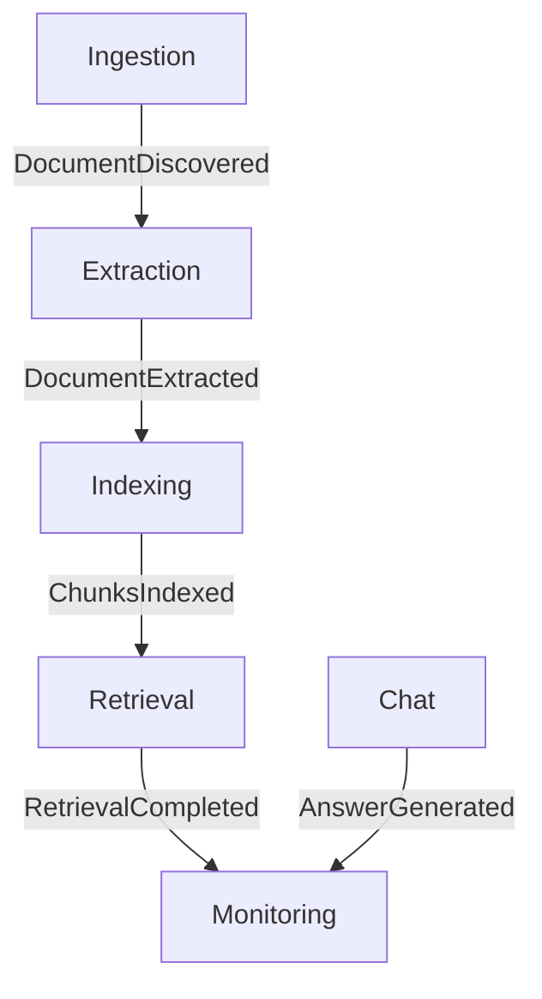

# MARP-Guide Chatbot — Events

This document defines the event types used across the MARP-Guide RAG pipeline and explains how they connect the microservices through RabbitMQ.  
All events follow a shared JSON envelope format and are published to durable AMQP queues.

---

## Event Catalogue

| **Event Name** | **Published By** | **Consumed By** | **Purpose** | **Key Fields in `data`** |
|----------------|------------------|-----------------|--------------|---------------------------|
| **DocumentDiscovered** | Ingestion Service | Extraction Service | Signals that a new MARP PDF has been discovered and downloaded. | `document_id`, `title`, `url`, `download_path`, `pages`, `discovered_at` |
| **DocumentExtracted** | Extraction Service | Indexing Service | Confirms that text and metadata were successfully extracted from a PDF. | `document_id`, `text_path`, `page_count`, `token_count`, `metadata` |
| **ChunksIndexed** | Indexing Service | Retrieval Service | Indicates that document chunks have been embedded and stored in the vector database. | `document_id`, `chunk_count`, `embedding_model`, `vector_db`, `index_path` |
| **RetrievalCompleted** | Retrieval Service | Monitoring Service | Notifies that a search query was executed and top-k snippets were returned. | `query_id`, `query_text`, `results`, `top_k`, `retrieval_time_ms` |
| **AnswerGenerated** | Chat Service | Monitoring Service | Announces that the Chat service generated an LLM-based answer for a user query. | `session_id`, `query_id`, `answer`, `citations`, `tokens_used`, `model`, `latency_ms` |

---

## Common Event Envelope

Every event message uses a consistent structure for traceability and monitoring.

```json
{
  "event_type": "EventName",
  "timestamp": "2025-10-22T12:34:56Z",
  "source_service": "service-name",
  "data": { /* event-specific payload */ }
}
```
---

## Event Schemas

### 1. DocumentDiscovered
```json
{
  "event_type": "DocumentDiscovered",
  "timestamp": "ISO-8601",
  "source_service": "ingestion",
  "data": {
    "document_id": "marp-2025-policy-v3",
    "title": "Assessment Regulations 2025",
    "url": "https://www.lancaster.ac.uk/.../Assessment_Regulations.pdf",
    "download_path": "/data/pdfs/Assessment_Regulations.pdf",
    "pages": 48,
    "discovered_at": "2025-10-21T10:15:00Z"
  }
}
```

### 2. DocumentExtracted
```json
{
  "event_type": "DocumentExtracted",
  "timestamp": "ISO-8601",
  "source_service": "extraction",
  "data": {
    "document_id": "marp-2025-policy-v3",
    "text_path": "/data/text/marp-2025-policy-v3.txt",
    "page_count": 48,
    "token_count": 12500,
    "metadata": {
      "title": "Assessment Regulations 2025",
      "extracted_by": "pdfplumber",
      "extracted_at": "2025-10-21T10:22:00Z"
    }
  }
}
```
### 3. ChunksIndexed
```json
{
  "event_type": "ChunksIndexed",
  "timestamp": "ISO-8601",
  "source_service": "indexing",
  "data": {
    "document_id": "marp-2025-policy-v3",
    "chunk_count": 214,
    "embedding_model": "all-MiniLM-L6-v2",
    "vector_db": "ChromaDB",
    "index_path": "/data/index/index.db"
  }
}
```
### 4. RetrievalCompleted
```json
{
  "event_type": "RetrievalCompleted",
  "timestamp": "ISO-8601",
  "source_service": "retrieval",
  "data": {
    "query_id": "q-173456789",
    "query_text": "What is the policy on late submission?",
    "top_k": 5,
    "results": [
      {
        "doc_id": "marp-2025-policy-v3",
        "page": 12,
        "title": "Assessment Regulations 2025",
        "score": 0.87
      }
    ],
    "retrieval_time_ms": 142
  }
}
```
### 5. AnswerGenerated
```json
{
  "event_type": "AnswerGenerated",
  "timestamp": "ISO-8601",
  "source_service": "chat",
  "data": {
    "session_id": "user-abc123",
    "query_id": "q-173456789",
    "answer": "According to the Assessment Regulations (page 12)…",
    "citations": [
      { "title": "Assessment Regulations 2025", "page": 12, "url": "https://..." },
      { "title": "Exam Policy 2025", "page": 4, "url": "https://..." }
    ],
    "tokens_used": 385,
    "model": "openrouter/gpt-4-mini",
    "latency_ms": 2350
  }
}
```
---

## Mermaid diagram
