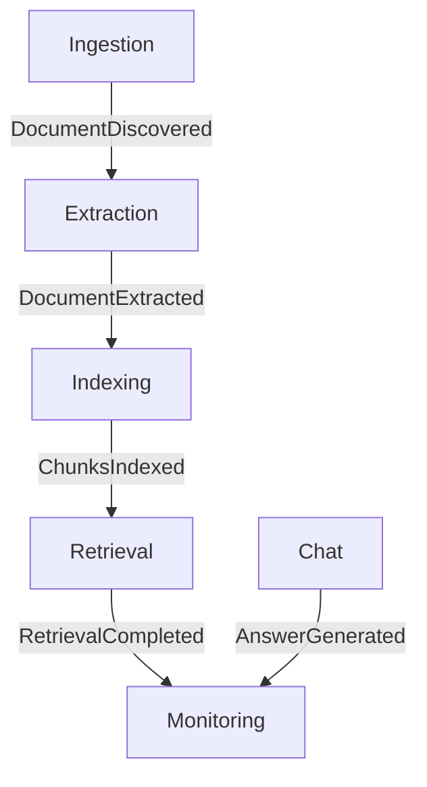

# MARP-Guide Chatbot — Events

This document defines the event types used across the MARP-Guide RAG pipeline and explains how they connect the microservices through RabbitMQ.  
All events follow a shared JSON envelope format and are published to durable AMQP queues.

---

## Event Catalogue

| **Event Name** | **Published By** | **Consumed By** | **Purpose** | **Key Fields in `payload`** |
|----------------|------------------|-----------------|--------------|---------------------------|
| **DocumentDiscovered** | Ingestion Service | Extraction Service | Signals that a new MARP PDF has been discovered and downloaded. | `document_id`, `title`, `url`, `download_path`, `pages`, `discovered_at` |
| **DocumentExtracted** | Extraction Service | Indexing Service | Confirms that text and metadata were successfully extracted from a PDF. | `document_id`, `text_path`, `page_count`, `token_count`, `metadata` |
| **ChunksIndexed** | Indexing Service | Retrieval Service | Indicates that document chunks have been embedded and stored in the vector database. | `document_id`, `chunk_count`, `embedding_model`, `vector_db`, `index_path` |
| **RetrievalCompleted** | Retrieval Service | Monitoring Service | Notifies that a search query was executed and top-k snippets were returned. | `query_id`, `query_text`, `results`, `top_k`, `retrieval_time_ms` |
| **AnswerGenerated** | Chat Service | Monitoring Service | Announces that the Chat service generated an LLM-based answer for a user query. | `session_id`, `query_id`, `answer`, `citations`, `tokens_used`, `model`, `latency_ms` |

---

## Common Event Envelope (v1)

All MARP-Guide events follow a **standard envelope** for traceability, versioning, and monitoring.

```json
{
  "eventType": "EventName",
  "eventId": "uuid-v4",
  "timestamp": "2025-10-22T12:34:56Z",
  "correlationId": "corr-id-xyz",
  "source": "service-name",
  "version": "1.0",
  "payload": { /* event-specific fields */ }
}
```
---

## Event Schemas

### 1. DocumentDiscovered
```json
{
  "eventType": "DocumentDiscovered",
  "eventId": "550e8400-e29b-41d4-a716-446655440000",
  "timestamp": "2025-10-22T14:30:00Z",
  "correlationId": "doc-marp-2025-v3",
  "source": "ingestion-service",
  "version": "1.0",
  "payload": {
    "documentId": "marp-2025-policy-v3",
    "title": "Assessment Regulations 2025",
    "url": "https://www.lancaster.ac.uk/.../Assessment_Regulations.pdf",
    "downloadPath": "/data/pdfs/Assessment_Regulations.pdf",
    "pages": 48,
    "discoveredAt": "2025-10-21T10:15:00Z",
    "fileSize": 2457600
  }
}
```

### 2. DocumentExtracted
```json
{
  "eventType": "DocumentExtracted",
  "eventId": "551e8400-e29b-41d4-a716-446655440001",
  "timestamp": "2025-10-22T14:40:00Z",
  "correlationId": "doc-marp-2025-v3",
  "source": "extraction-service",
  "version": "1.0",
  "payload": {
    "documentId": "marp-2025-policy-v3",
    "textPath": "/data/text/marp-2025-policy-v3.txt",
    "pageCount": 48,
    "tokenCount": 12500,
    "metadata": {
      "title": "Assessment Regulations 2025",
      "extractedBy": "pdfplumber",
      "extractedAt": "2025-10-21T10:22:00Z"
    }
  }
}
```
### 3. ChunksIndexed
```json
{
  "eventType": "ChunksIndexed",
  "eventId": "552e8400-e29b-41d4-a716-446655440002",
  "timestamp": "2025-10-22T14:55:00Z",
  "correlationId": "doc-marp-2025-v3",
  "source": "indexing-service",
  "version": "1.0",
  "payload": {
    "documentId": "marp-2025-policy-v3",
    "chunkCount": 214,
    "embeddingModel": "all-MiniLM-L6-v2",
    "vectorDb": "ChromaDB",
    "vectorDimension": 384,
    "indexPath": "/data/index/index.db"
  }
}
```
### 4. RetrievalCompleted
```json
{
  "eventType": "RetrievalCompleted",
  "eventId": "553e8400-e29b-41d4-a716-446655440003",
  "timestamp": "2025-10-22T15:00:00Z",
  "correlationId": "usr-query-789",
  "source": "retrieval-service",
  "version": "1.0",
  "payload": {
    "queryId": "q-173456789",
    "query": "What is the policy on late submission?",
    "resultsCount": 5,
    "topScore": 0.87,
    "latencyMs": 142,
    "results": [
      { "docId": "marp-2025-policy-v3", "page": 12, "title": "Assessment Regulations 2025", "score": 0.87 }
    ]
  }
}
```
### 5. AnswerGenerated
```json
{
  "eventType": "AnswerGenerated",
  "eventId": "554e8400-e29b-41d4-a716-446655440004",
  "timestamp": "2025-10-22T15:02:30Z",
  "correlationId": "usr-query-789",
  "source": "chat-service",
  "version": "1.0",
  "payload": {
    "sessionId": "user-abc123",
    "queryId": "q-173456789",
    "answer": "According to the Assessment Regulations (page 12)…",
    "citationCount": 2,
    "citations": [
      { "title": "Assessment Regulations 2025", "page": 12, "url": "https://..." },
      { "title": "Exam Policy 2025", "page": 4, "url": "https://..." }
    ],
    "llmModel": "openrouter/gpt-4-mini",
    "tokensUsed": 385,
    "latencyMs": 2350
  }
}
```
---

## Mermaid diagram

